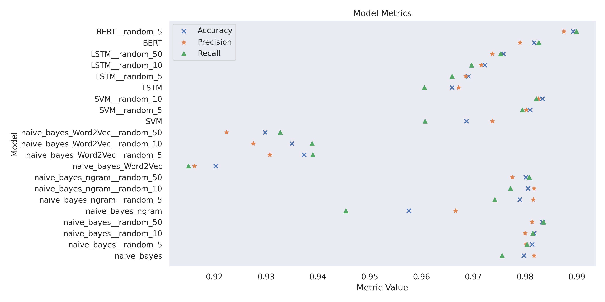
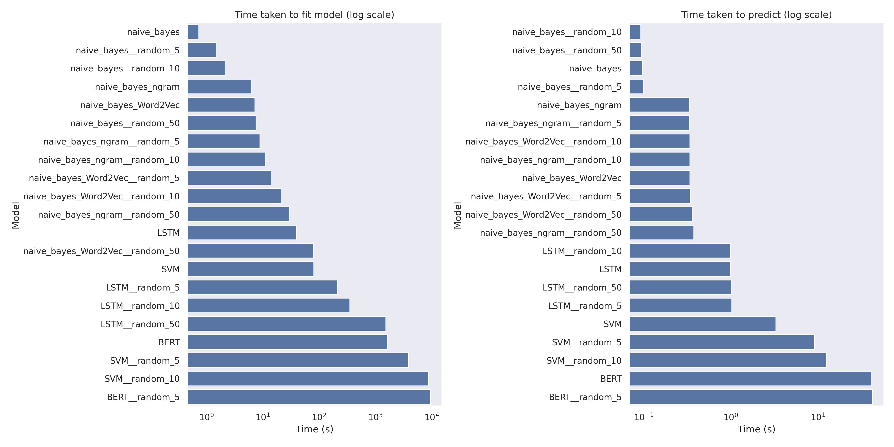

# README

- [README](#readme)
  - [Conclusion](#conclusion)
  - [Creating environment and running the code](#creating-environment-and-running-the-code)
  - [Workflow overview](#workflow-overview)
    - [1. Data exploration](#1-data-exploration)
    - [2. Preprocessing](#2-preprocessing)
    - [3. Model development](#3-model-development)
    - [4. Model evaluation](#4-model-evaluation)
    - [Accuracy](#accuracy)
    - [Precision](#precision)
    - [Recall](#recall)
      - [Model Performance Metrics](#model-performance-metrics)
      - [Model Training Time](#model-training-time)
    - [K-Fold Cross Validation](#k-fold-cross-validation)
    - [Hardest to classify paragraphs](#hardest-to-classify-paragraphs)
      - [False Negatives](#false-negatives)
      - [False Positives](#false-positives)
  - [What I am pleased with](#what-i-am-pleased-with)
  - [What I would like to improve](#what-i-would-like-to-improve)

## Conclusion

As a high-level conclusion, I can say that I was successful in my goal of creating a simple, yet effective, model for identifying which paragraphs have been written by Jane Austen.

The best model (BERT) achieves an accuracy of 0.9893. Considering the relatively
small size of the dataset, and limited model development time, this is a very good result.


## Creating environment and running the code
Clone the repository and install the required packages:

( There are a lot of packages as I have tested several models.
For a minimal install, use `min_requirements.txt` instead of `requirements.txt` 
This will allow you to run the Naive Bayes model and ipython notebooks. )

```bash
git clone git@github.com:FiAWe/recruitment-ml.git
cd recruitment-ml

python3 -m venv .venv
source .venv/bin/activate

pip install -r requirements.txt
```

I ran the code on a machine with 16GB of RAM and an Nvidia 1080 GPU. The code should run on any machine with at least 8GB of RAM and a GPU with at least 4GB of VRAM. For lower specs, batch size can be reduced further for the LSTM and BERT models.

Models are stored in the `models` directory. The models available are:
- `naive_bayes.py`
- `naive_bayes_ngram.py`
- `naive_bayes_Word2Vec.py`
- `svm.py`
- `lstm.py`
- `bert.py`

To run the code, navigate to the `models` directory.
```bash
cd models
```


To train a model (e.g. naive_bayes), run the following command:

```bash
python naive_bayes.py
```

This will create, train, and test the model. The summary statistics will be printed to the console.
The model's predictions and charts will be saves to `models/results/`.


To run with random substrings, add the `--generate_substrings` and `--random_substrings {n}` flags:

```bash
python naive_bayes.py --generate_substrings --random_substrings 5
```

`naive_bayes.py` also has the option to run k-fold cross-validation with the `--kfolds` flag:

```bash
python naive_bayes.py --kfold
```

To run all the models in order to run the analysis, run the following command:

```bash
bash all_model_calls.sh
```


## Workflow overview
### 1. Data exploration
   
I started by doing some EDA on the dataset. This work can be seen in the notebook `EDA/initial_EDA.ipynb`.

I looked at the formatting of the data, the distribution of the labels, and the length distribution of the paragraphs. I also looked at words more or less common in Jane Austen's paragraphs.

This analysis helped me to understand the data and make some decisions about the preprocessing steps. It also seemed like there were strong trends in the words and sentence structure used by Jane Austen.

### 2. Preprocessing  

I wrote a helper script to load and preprocess the data. This script is `model_preprocessing.py`. It loads the data, preprocesses it, and splits it into training and testing sets. ( Or gives a k-fold split generator for cross-validation)

The preprocessing steps include:
- Removing punctuation
- Lowercasing
- Homogenizing the whitespace and stripping any leading/trailing whitespace

This script also contains a method for data enrichment by giving an option to create random sub-strings of the paragraphs in the training set.

All random splitting is seeded so that the analysis is reproducible.

### 3. Model development
  
I developed several models to predict the author of the paragraphs. The models ( in order of development) are:
- Naive Bayes
- Naive Bayes with n-grams
- Naive Bayes with Word2Vec
- SVM
- LSTM
- BERT Transformer

I used:
- scikit-learn library for the Naive Bayes and SVM models ( with gensim for Word2Vec).
- Tensorflow.Keras for the LSTM model.
- Hugging Face Transformers library for the BERT model.

### 4. Model evaluation

I evaluated the models using accuracy, precision, recall, and F1-score. The ROC and PR curves were also plotted and their AUC calculateds.

Full analysis of all the models and the effects of random sub-string enrichment can be found in the `model_analysis.ipynb` notebook. With a summary here:

First, looking at the primary metrics, with each model on a row and the number of random sub-strings per input paragraph on a column. ( Best results per sub-string count are in bold)

### Accuracy
| Model                | 0          | 5          | 10         | 50         |
| -------------------- | ---------- | ---------- | ---------- | ---------- |
| BERT                 | **0.9818** | **0.9893** | nan        | nan        |
| LSTM                 | 0.9659     | 0.9691     | 0.9722     | 0.9758     |
| SVM                  | 0.9687     | 0.9810     | **0.9833** | nan        |
| naive_bayes          | 0.9798     | 0.9814     | 0.9818     | **0.9833** |
| naive_bayes_Word2Vec | 0.9203     | 0.9374     | 0.9350     | 0.9298     |
| naive_bayes_ngram    | 0.9576     | 0.9790     | 0.9806     | 0.9802     |

### Precision
| Model                | 0          | 5          | 10         | 50         |
| -------------------- | ---------- | ---------- | ---------- | ---------- |
| BERT                 | 0.9790     | **0.9875** | nan        | nan        |
| LSTM                 | 0.9672     | 0.9685     | 0.9715     | 0.9736     |
| SVM                  | 0.9736     | 0.9802     | **0.9826** | nan        |
| naive_bayes          | **0.9817** | 0.9802     | 0.9800     | **0.9813** |
| naive_bayes_Word2Vec | 0.9162     | 0.9307     | 0.9275     | 0.9224     |
| naive_bayes_ngram    | 0.9666     | 0.9816     | 0.9817     | 0.9775     |

### Recall
| Model                | 0          | 5          | 10         | 50         |
| -------------------- | ---------- | ---------- | ---------- | ---------- |
| BERT                 | **0.9827** | **0.9900** | nan        | nan        |
| LSTM                 | 0.9606     | 0.9659     | 0.9697     | 0.9753     |
| SVM                  | 0.9607     | 0.9795     | **0.9822** | nan        |
| naive_bayes          | 0.9756     | 0.9804     | 0.9815     | **0.9836** |
| naive_bayes_Word2Vec | 0.9150     | 0.9390     | 0.9389     | 0.9327     |
| naive_bayes_ngram    | 0.9454     | 0.9741     | 0.9772     | 0.9808     |

#### Model Performance Metrics

( Model naming convention is {model_name}__{sub_string_count} )

As can be seen, the BERT model is the best performing model in terms of accuracy, precision, and recall.

Naive Bayes performed very well, considering the ease of implementation and the low computational cost. As this was the first model tested, it set a high benchmark for the other models - where improvment was focussed on the edge cases.

Model training time vared significantly between models. Naive Bayes was the fastest to train, with BERT and the SVM being the slowest. These 2 also got substantially slower with the addition of random sub-strings - to the point that it was not feasible to test with 50 sub-strings.

The sub-strings were effective in improving the performance of the models in general. However the benefit compared to 
computation time was relatively low, and further tuning of the models would possibly have resulted in similar gains. That said, one of the challenges to very high performance is the limited scale of the dataset, so data augmentation is a useful tool.

#### Model Training Time


### K-Fold Cross Validation
I only implemented k-fold cross-validation at the end and ran it for Naive Bayes as the model training time was very low. This gave a better idea of the model's performance and allowed for more robust hyperparameter tuning.
| fold     | accuracy   | precision  | recall     | f1         | roc_auc    |
| -------- | ---------- | ---------- | ---------- | ---------- | ---------- |
| 0        | 0.980174   | 0.980724   | 0.977016   | 0.97881    | 0.997545   |
| 1        | 0.982554   | 0.98306    | 0.979758   | 0.981361   | 0.99844    |
| 2        | 0.978192   | 0.981022   | 0.972719   | 0.976583   | 0.998061   |
| 3        | 0.975813   | 0.97726    | 0.971227   | 0.974086   | 0.996745   |
| 4        | 0.98295    | 0.983592   | 0.980062   | 0.981773   | 0.998607   |
| main run | 0.979778   | 0.981735   | 0.975565   | 0.978473   | 0.998224   |
| mean     | 0.979937   | 0.981132   | 0.976156   | 0.978523   | 0.99788    |
| std      | 0.00300146 | 0.00249679 | 0.00403357 | 0.00324584 | 0.00075421 |

As can be seen, the model performs well across all folds. The standard deviation is low, indicating that the model is stable and generalizes well, though it is possible to get lucky with the random seed. Further testing would be ideal to confirm the performance.

### Hardest to classify paragraphs
I also looked at the paragraphs that were hardest to classify. These were the paragraphs that the models were least correct and least confident about.

#### False Negatives
These are the 5 paragraphs that the model was most confident were not written by Jane Austen, but were actually written by her.
|      | text                                                                                                                                                                                                                                                                                                           | Avg. Probability | correct | label |
| ---- | -------------------------------------------------------------------------------------------------------------------------------------------------------------------------------------------------------------------------------------------------------------------------------------------------------------- | ---------------- | ------- | ----- |
| 373  | at this point in the first and second editions volume 1 ends                                                                                                                                                                                                                                                   | 0.188247         | 1       | 1     |
| 749  | good or bad said she quickly looking up in his face                                                                                                                                                                                                                                                            | 0.127047         | 2       | 1     |
| 2235 | upon the knoll behind the house the old walnut trees are all come down to make room for it it will be a very fine object from many parts of the park and the flower-garden will slope down just before it and be exceedingly pretty we have cleared away all the old thorns that grew in patches over the brow | 0.179066         | 2       | 1     |
| 2076 | then i take it for granted observed sir walter that his face is about as orange as the cuffs and capes of my livery                                                                                                                                                                                            | 0.296327         | 4       | 1     |
| 1534 | not at all not at all there is not an oath or a murmur from beginning to end                                                                                                                                                                                                                                   | 0.330246         | 4       | 1     |

The most incorrect one looks to be a not from the publisher or editor of a book and explains why it would be hard to classify as it is not actually written by Jane Austen.

#### False Positives
These are the 5 paragraphs that the model was most confident were written by Jane Austen, but were actually not written by her.
|      | text                                                                                                                                                                                                                                                                                        | prediction_proba | correct | label |
| ---- | ------------------------------------------------------------------------------------------------------------------------------------------------------------------------------------------------------------------------------------------------------------------------------------------- | ---------------- | ------- | ----- |
| 149  | 6 what will be will be well for what is is well to take interest is well and not to take interest shall be well                                                                                                                                                                             | 0.689019         | 5       | 0     |
| 1220 | it sounded an excellent plan no doubt and very neatly and simply arranged the only difficulty was that she had not the smallest idea how to set about it and while she was peering about anxiously among the trees a little sharp bark just over her head made her look up in a great hurry | 0.720465         | 7       | 0     |
| 480  | by jove i cried and that's true enough my own mother's family had a banshee and now i come to think of it it has comforted me in many a cold hour                                                                                                                                           | 0.656342         | 8       | 0     |
| 231  | alice was very glad to find her in such a pleasant temper and thought to herself that perhaps it was only the pepper that had made her so savage when they met in the kitchen                                                                                                               | 0.60397          | 8       | 0     |
| 1018 | i gave her one they gave him two you gave us three or more they all returned from him to you though they were mine before                                                                                                                                                                   | 0.615139         | 9       | 0     |


## What I am pleased with
I enjoyed working on this project and am pleased with the results. The initial
simple models performed surprisingly well, but there was still improvement to be made using more complex models.

I am pleased with the performance of the BERT model. It is a very powerful model and it was interesting to see how it performed on this task. It is pretrained, so relies on a lot more context than the other models. This is likely part of the reason it performed so well.

I have started to refactor the code to make it more scalable and easier to maintain. Although just a demonstration, I always aim to make the code as clean and readable as possible. Allowing for easy testing of different models and extension of functionality.

## What I would like to improve
This was a very time constrained project, so there are many things I would like to improve.
One thing I only touched on at the end was repetition and k-fold cross-validation. This would give a better idea of the model's performance and allow for more robust hyperparameter tuning.

I have implemented a function for k-fold cross-validation, and run it for the Naive Bayes model. I would also like to implement repetition, which is a simple addition due to the set up of the splitters using a seed.

A major step for improvement would be hyperparameter tuning. I have only done a small amount for these models, without a full grid search. This would likely improve the performance of the models. In particular the deep models have a lot of further potential which could be explored with hyperparameter tuning.

A further area to explore is how the text pre-processing affects the model score. I applied basic text-preprocessing to standardise the inputs. But punctuation, capitalisation, and other features could be used to improve the model.

Finally, I would like to explore more models. I have only tested a few models, but there are many more that could be tested. For example, I would like to test the state-of-the-art transformer models like GPT-3 and Gemini. These models cannot be run locally, and instead either need to be fine-tuned withing their own ecosystem or used via one-shot/few-shot learning.